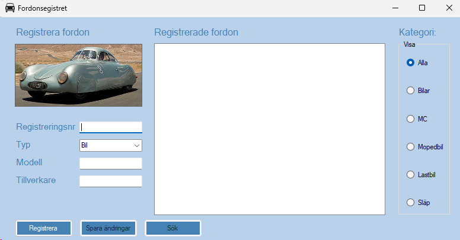

# Bilregister - Windows Forms-applikation

## Beskrivning
Detta projekt är en inledande övningsuppgift I Programmering 2 för validering med set-metoder, användande av ArgumentException och en introduktion till override. Det är samtidigt en repetition av olika tekniker från Programmering 1.

Uppgiften handlar om ett bilregister, utvecklat som en Windows Forms-applikation i C#. Programmet är tänkt att möjliggöra för användare att registrera fordon med olika attribut (som registreringsnummer, märke, modell och årsmodell) och validera inmatningar för att säkerställa att endast giltig information sparas. Projektet är utvecklat för .NET 8 eller senare.



## Uppgiftsbeskrivning
Att färdigställa koden som tillhandahålls på GitHub genom att implementera validering av användarens inmatning i applikationens gränssnitt. Specifika valideringar som krävs beskrivs nedan.

### Kriterier för bedömning:

#### Inte acceptabel nivå
Kriterierna nedan är inte uppfyllda.

#### Förväntad nivå
- Det ska inte gå att registrera en bil utan att ett modellnamn har angetts.
- Det ska inte gå att registrera en bil utan att ett märkesnamn har angetts.
- En bil ska ha en årsmodell i formatet `2024`, enligt mönstret `[1-2][0-9][0-9][0-9]` (dvs. årsmodellen måste börja med 1 eller 2 och ha exakt fyra siffror).

#### Över förväntad nivå
- Modellnamnet ska inte kunna innehålla icke-relevanta symboler, exempelvis `@#&)=`.
- Märkesnamnet ska inte kunna innehålla icke-relevanta symboler.

## Tekniker och språk
- **Plattform**: Windows Forms för att skapa ett grafiskt användargränssnitt (GUI).
- **Språk**: C#.
- **Framework**: .NET 8 eller senare.

## Instruktioner för installation och körning
1. Klona detta GitHub-repo:
    ```bash
    git clone <[repo](https://github.com/TeacherArea/PRG2_CarRegistry_repetition_OOP.git)>
    ```
2. Öppna projektet i Visual Studio.
3. Bygg och kör projektet.
4. Använd applikationens gränssnitt för att registrera fordon och se till att alla valideringar uppfylls.

## Funktionalitet
- Registrera fordon med märke, modell och årsmodell.
- Visa registrerade fordon i en lista.
- Filtrera fordon utifrån fordonstyp (t.ex. bil, MC, lastbil).
- Validering av registreringsnummer, märke och modell för att förhindra ogiltig inmatning.

## Utökning av applikationen
Applikationen har även möjlighet till vidareutveckling:
- **Sökfunktion**: Möjlighet att söka efter fordon (för tillfället döljs knappen).
- **Ändringsfunktion**: Möjlighet att spara ändringar för redan registrerade fordon (för tillfället döljs knappen).

## Bedömningskriterier
Bedömning sker utifrån följande nivåer:
1. **Inte acceptabel nivå**: Inmatningsvalideringar har inte implementerats enligt kraven.
2. **Förväntad nivå**: Grundläggande valideringar är implementerade och applikationen fungerar utan felaktiga inmatningar.
3. **Över förväntad nivå**: Mer avancerad validering är implementerad, inklusive förhindra användning av irrelevanta symboler i modell- och märkesnamn.
